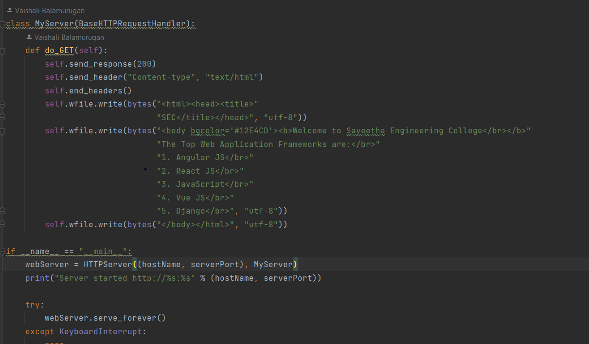
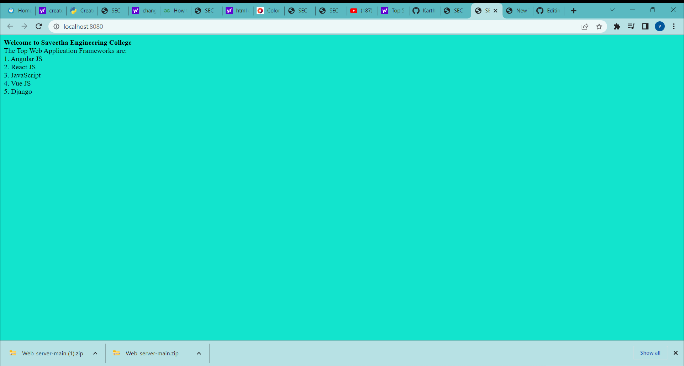

# Developing a Simple Webserver

# AIM:

Develop a webserver to display about top five web application development frameworks.

# DESIGN STEPS:

## Step 1:

HTML content creation is done

## Step 2:

Design of webserver workflow

## Step 3:

Implementation using Python code

## Step 4:

Serving the HTML pages.

## Step 5:

Testing the webserver

# PROGRAM:

# OUTPUT:

# RESULT:

The program is executed succesfully

